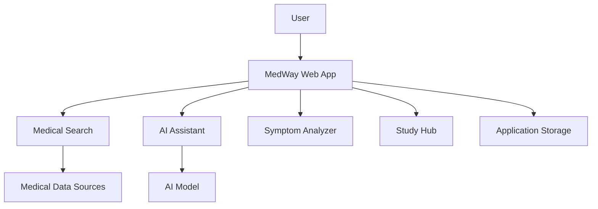

# MedWay

### AI-Powered Medical Search & Learning Platform

MedWay is an AI-powered medical search platform designed to make trusted medical information easier to discover, understand, and explore.

It combines medical search, AI-assisted explanations, symptom exploration, clinical comparisons, and learning tools into a single web application.

 **Disclaimer:** MedWay is an educational and information-retrieval platform and does not replace professional medical diagnosis, advice, or treatment.

---

##  Features

*  **Medical Search** — Search and explore medical information.
*  **AI Assistance** — Get AI-powered explanations of complex medical topics.
*  **Symptom Analyzer** — Explore symptoms and related medical information.
*  **Clinical Comparison** — Compare relevant medical information.
*  **Study Hub** — Flashcards, quizzes, and medical learning resources.
*  **Persona Mode** — Tailored experiences for different types of users.
*  **Export** — Export useful information for later reference.

---

##  Architecture



---

##  Tech Stack

* **TypeScript**
* **React**
* **Vite**
* **AI / LLM Integration**
* **REST APIs**
* **PNPM**
* **Git & GitHub**

---

## 🚀 Getting Started

### Prerequisites

* Node.js
* PNPM

### Installation

```bash
git clone https://github.com/TabotAlistar-gift/Medical-search-engine.git

cd Medical-search-engine

pnpm install
```

### Environment Variables

Create a `.env` file and add the required API credentials.

```env
API_KEY=your_api_key
```


### Run locally

```bash
pnpm dev
```

---

## 📁 Project Structure

```text
Medical-search-engine/
├── lib/
├── scripts/
├── artifacts/
├── package.json
├── pnpm-lock.yaml
├── tsconfig.json
└── README.md
```

---

##  Motivation

Medical information is often distributed across different platforms and can be difficult to understand.

MedWay aims to create a simpler interface for discovering and learning from medical information while combining traditional search with AI-assisted exploration.

---

## 🔮 Future Improvements

* More trusted medical data sources
* Improved AI grounding and citations
* Advanced personalization
* Expanded medical learning tools
* Improved search and recommendation systems
* Enhanced privacy and security

---

##  Author

**Tabot Alistar-Gift**

Software Engineer | Full-Stack Developer

[GitHub](https://github.com/TabotAlistar-gift) 

---

### ⚠️ Medical Disclaimer

MedWay is intended for educational and informational purposes only. Information provided by the platform, including AI-generated content, should not be considered professional medical advice or a diagnosis.
